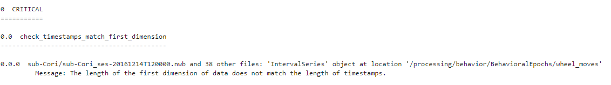

Using the Command Line Interface (CLI)
======================================

The NWBInspector tool offers convenient command-line usage via any standard Conda or IPython terminal.

You may then run the NWBInspector via the command line via the following usages

::

    # supply a path to a single NWBFile
    nwbinspector path/to/my/data.nwb

    # supply a path to a directory containing several NWBFiles (this will recurse to subdirectories)
    nwbinspector path/to/my/data/dir/

which should quickly display a basic report to your console window.

All available options for the CLI may be viewed by calling :code:`nwbinspector --help`. We will now highlight some of
the most useful of these options.

Formatting the Report
---------------------

The basic report layout organizes by :py:attr:`~nwbinspector.register_check.InspectorMessage.importance` first and
:py:attr:`~nwbinspector.register_check.InspectorMessage.file_path` last.

However, the NWBInspector supports more general organization as defined by the `--levels` flag. To use this flag,
you must pass a series a comma-separated words that correspond to any attributes of the
:py:class:`~nwbinspector.register_check.InspectorMessage` in any order.

For example,

::

    nwbinspector path/to/my/data/dir/ --levels check_function_name,object_type,file_path

.. note::

    The :py:attr:`~nwbinspector.register_check.InspectorMessage.message` itself cannot be used in organization.

The ascending or descending order of each of these levels may be additionally controlled with the `--reverse` flag,
which is likewise a comma-separated series of boolean words.

For example,

::

    nwbinspector path/to/my/data/dir/ --levels check_function_name,object_type,file_path --reverse false,true,false

.. note::

    Valid 'boolean words' are any capitalizations of the words ``"false", "true"`` or characters ``"F", "T"``, and even
    numbers like ``"0, 1"``.

The defalt report also aggregates identical outputs into a summary over multiple files; running

::

    nwbinspector 000017 --stream

gives an output containing

as an example. It will do this any time the last value of the ``--levels`` list is ``file_path``. To see the full report of every
issue over all files, use the ``--detailed`` flag.

Saving the Report
-----------------

There are many common options you can specify with flags, such as saving the report for future reference...

::

    nwbinspector path/to/my/data.nwb --report-file-path path/to/my/nwbinspector_report.txt

If a report file from a previous run of the inspector is already present at the location, it can be overwritten with
the ``-o`` or ``--overwrite`` flag...

::

    nwbinspector path/to/my/data.nwb --report-file-path path/to/my/nwbinspector_report.txt -o

Faster Inspection
-----------------

The NWBInspector supports parallelization over a directory to allow the NWBInspector to run many times faster. To use
this feature, simply set the ``--n-jobs`` flag to either a positive integer corresponding to the number of CPUs you
wish to use, or set to ``-1`` to use all available system resources.

For example,

::

    nwbinspector path/to/my/data/dir/ --n-jobs -1

External Modules
----------------

If the NWBFiles being inspected require an external module to parse, or have externally defined check registries (such
as those specific to an :nwb-schema:ref:`NWB Extension<extending-the-format>`), these can be specified with the ``-m``
or ``--modules`` flag.

For example,

::

    nwbinspector path/to/my/data.nwb -m my_extension_module1 my_extension_module2
